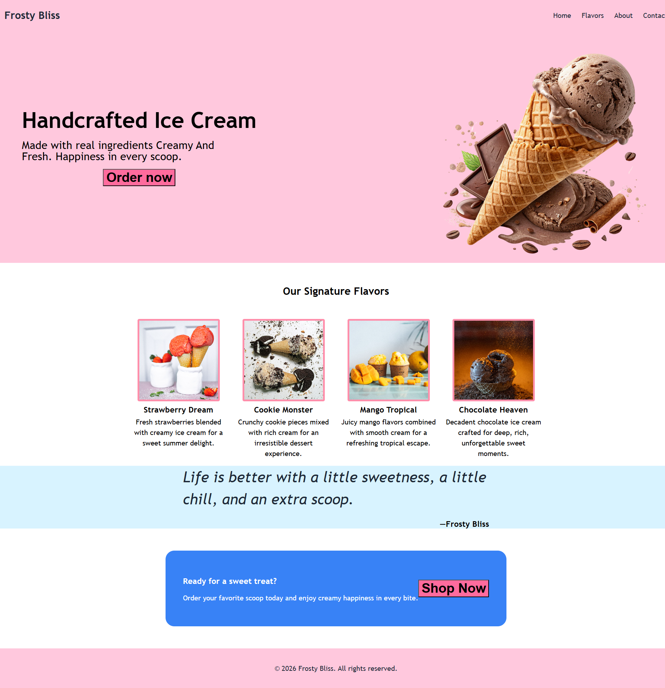

# Frosty Bliss

A simple landing page for a fictional ice cream brand built with **HTML** and **CSS** as part of **The Odin Project Foundations** curriculum.

Although this is a beginner project, it focuses on building a clean, modern layout while practicing essential front-end development concepts.

---

## About

**Frosty Bliss** is the **second project** in **The Odin Project Foundations** curriculum.

The assignment provides a layout blueprint rather than a specific website theme. Instead of recreating the sample content, I decided to build a custom landing page for a fictional ice cream brand while following the required structure.

I chose this theme because I started the project during the summer and thought an ice cream brand would make the assignment more fun and visually appealing.

---

## What I Learned

Throughout this project, I practiced and improved my understanding of:

* HTML
* CSS Fundamentals
* Flex box Layout
* Typography
* Spacing and Alignment
* Organizing content into reusable sections
* Building a complete landing page from scratch

---

## Technologies Used

* HTML5
* CSS3
* Flex box

---

## Preview & Live Demo

https://hamzafullstack.github.io/frosty-bliss-landing-page/

---

## Project Note

The name **Frosty Bliss** was chosen by me for this educational project.

Before using it, I searched to see whether it was associated with an existing ice cream brand and couldn't find anything relevant. If I have unintentionally used a name that belongs to your business or brand, please open an issue on this repository. I'll gladly rename or remove it.

If your brand adopted this name after the creation date of this repository, please understand that this project predates your use of the name.

This repository is **not affiliated with, endorsed by, or connected to any existing company or brand**.

---

## Credits

This project was created as part of **The Odin Project Foundations** curriculum.

The branding, content, and design choices are my own and were created solely for learning and portfolio purposes.

---

## License

This project is licensed under the **MIT License**. Feel free to explore the code, learn from it, and use it in accordance with the terms of the license.